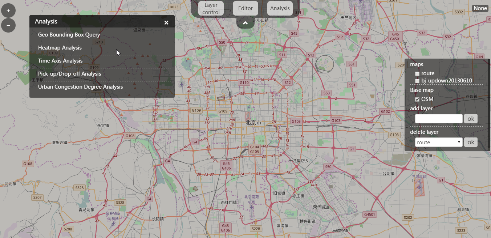
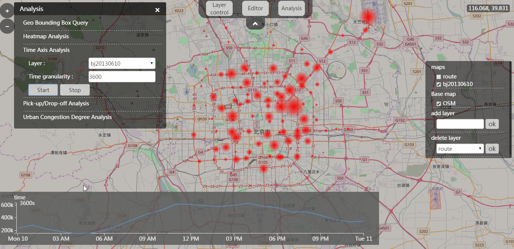

# TaxiData-FastVisual
TaxiData-FastVisual is a fast visualization project for taxi data. Data storage methods use the quadtree partitioning.

## Implementation
|framework
-|-
front-end|jquery+bootstrap, D3.js, openlayer3.js
back-end|geoserver+Tomcat, spring, postgreSQL, jetty
	
## Modules
- **Editing Features**

- **Geo Bounding Box Query**

- **Heatmap Analysis**

- **Time Axis Analysis**

- **Pick-up/Drop-off Analysis**

- **Urban Congestion Degree Analysis**

